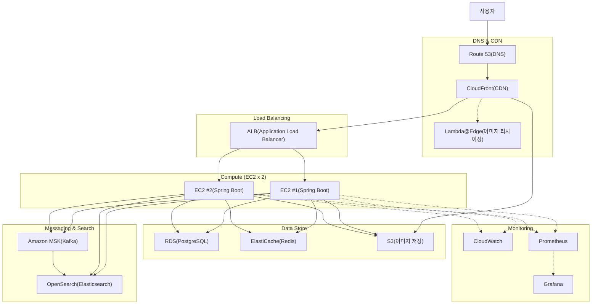

# 프로젝트 개요

**Biddo**는 중고 상품을 대상으로 한 실시간 경매 플랫폼입니다. 사용자는 중고 물품을 등록하고, 다른 사용자들이 입찰에 참여하여 경매 방식으로 거래할 수 있습니다.

> 본 프로젝트는 개발자 포트폴리오 시연 목적으로 제작되었습니다.
>

---

# 기술 스택 (Tech Stack)

## Backend

| 구분 | 기술 | 설명 |
| --- | --- | --- |
| Language | Java 17+ | 메인 개발 언어 |
| Framework | Spring Boot 3.x | REST API 서버 프레임워크 |
| ORM | Spring Data JPA (Hibernate) | 데이터베이스 ORM |
| Build Tool | Gradle | 빌드 및 의존성 관리 |

## Database & Cache

| 구분 | 기술 | 설명 |
| --- | --- | --- |
| RDBMS | PostgreSQL | 메인 데이터베이스 (상품, 사용자, 경매 기록) |
| Cache / Session | Redis | 입찰 실시간 처리, 세션 관리, 캐싱 |

## Messaging & Real-time

| 구분 | 기술 | 설명 |
| --- | --- | --- |
| Message Broker | Apache Kafka | 입찰 이벤트 스트리밍, 알림 처리, 비동기 메시지 큐 |
| Real-time (양방향) | WebSocket | 실시간 입찰 업데이트, 1:1 채팅 |
| Real-time (단방향) | SSE (Server-Sent Events) | 경매 카운트다운, 알림 푸시 |

## Search Engine

| 구분 | 기술 | 설명 |
| --- | --- | --- |
| Full-text Search | Elasticsearch | 키워드/카테고리/가격 범위 등 고급 검색 엔진 |

## AWS 인프라

| 구분 | 서비스 | 스펙 / 설명 |
| --- | --- | --- |
| Compute | EC2 x 2 | t2.micro (또는 t3.micro) — 최소 사양 2대 운영 |
| Load Balancing | ALB (Application Load Balancer) | 2대 EC2 간 트래픽 분산 |
| DNS | Route 53 | 도메인 관리 및 라우팅 |
| Storage | S3 | 상품 이미지 저장소 |
| CDN | CloudFront | 이미지 및 정적 리소스 캐싱/배포 |
| Database | RDS (PostgreSQL) | 관리형 PostgreSQL 인스턴스 |
| Cache | ElastiCache (Redis) | 관리형 Redis 클러스터 |
| Messaging | Amazon MSK (Managed Kafka) | 관리형 Kafka 클러스터 |
| Search | Amazon OpenSearch Service | 관리형 Elasticsearch (검색 엔진) |
| Image Processing | Lambda@Edge | 이미지 리사이징/썸네일 생성 (CloudFront 연동) |
| Container Registry | ECR | Docker 이미지 저장소 (선택) |
| Secret Management | Secrets Manager | DB 비밀번호, API 키 등 보안 관리 |
| Monitoring | CloudWatch | AWS 리소스 모니터링 및 로그 수집 |

## Monitoring & Performance

| 구분 | 기술 | 설명 |
| --- | --- | --- |
| Metrics | Prometheus | 애플리케이션 메트릭 수집 |
| Dashboard | Grafana | 모니터링 대시보드 시각화 |
| Load Testing | K6 | 부하 테스트 및 성능 측정 |
| AWS Monitoring | CloudWatch | 인프라 레벨 모니터링 |

## DevOps & Version Control

| 구분 | 기술 | 설명 |
| --- | --- | --- |
| VCS | Git / GitHub | 소스코드 버전 관리 |
| CI/CD | GitHub Actions | 자동 빌드/배포 파이프라인 (추천) |
| Container | Docker | 애플리케이션 컨테이너화 |

---

# 인프라 아키텍처 요약

---

# 비용 최적화 참고

- EC2 t2.micro / t3.micro는 프리 티어 대상이며, 개발/소규모 운영에 적합합니다.
- MSK는 비용이 높으므로, 초기에는 EC2 위에 Kafka를 직접 설치하는 방안도 고려할 수 있습니다.
- ElastiCache 역시 초기에는 EC2 내 Redis 직접 설치로 비용 절감 가능합니다.
- RDS 프리 티어 (db.t3.micro)를 활용하면 12개월 무료 사용 가능합니다.

---

# 요구사항

아래 데이터베이스에서 상세 요구사항을 관리합니다.

[요구사항 목록](requirements.md)

[ERD (Entity Relationship Diagram)](ERD.md)

[프로젝트 구조 & 코딩 컨벤션](프로젝트_구조&코딩_컨벤션.md)

[API 명세서](API_명세서.md)

[비즈니스 규칙 정의서](비즈니스_규칙_정의서.md)

[시스템 아키텍처 & 시퀀스 다이어그램](시스템_아키텍처&시퀀스_다이어그램.md)

[[claude.md] (AI 개발 가이드)](../claude.md)