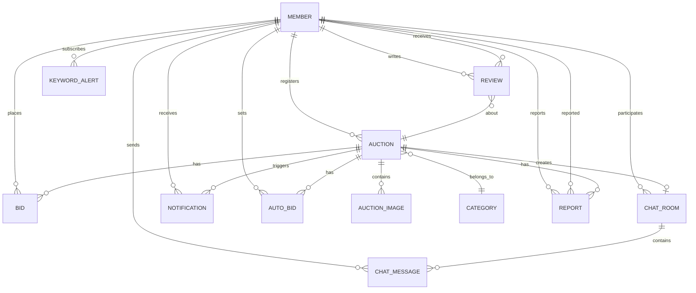

# ERD 개요

중고 경매 시스템의 데이터베이스 설계입니다. PostgreSQL 기반이며, JPA 엔티티 매핑을 고려하여 설계되었습니다.

---

# 엔티티 관계 다이어그램

---

# 엔티티 상세

## 1. Member (회원)

| 컬럼명 | 타입 | 제약조건 | 설명 |
| --- | --- | --- | --- |
| member_id | BIGINT | PK, AUTO_INCREMENT | 회원 고유 ID |
| email | VARCHAR(255) | UNIQUE, NOT NULL | 이메일 (로그인 ID) |
| password | VARCHAR(255) | NOT NULL | 비밀번호 (BCrypt 암호화) |
| nickname | VARCHAR(50) | UNIQUE, NOT NULL | 닉네임 |
| profile_image_url | VARCHAR(500) |  | 프로필 이미지 URL (S3) |
| introduction | VARCHAR(500) |  | 자기소개 |
| trust_score | DECIMAL(2,1) | DEFAULT 0.0, CHECK(0.0~5.0) | 신뢰도 점수 (0.0~5.0) |
| role | VARCHAR(20) | DEFAULT 'USER' | 권한 (USER, ADMIN) |
| ban_type | VARCHAR(20) | | 제재 유형 (WARNING, SUSPEND, BAN) |
| ban_reason | VARCHAR(500) | | 제재 사유 |
| ban_end_date | TIMESTAMP | | 제재 종료일 (SUSPEND 시 사용) |
| created_at | TIMESTAMP | NOT NULL | 가입일 |
| updated_at | TIMESTAMP | NOT NULL | 수정일 |

---

## 2. Category (카테고리)

| 컬럼명 | 타입 | 제약조건 | 설명 |
| --- | --- | --- | --- |
| category_id | BIGINT | PK, AUTO_INCREMENT | 카테고리 ID |
| name | VARCHAR(100) | NOT NULL | 카테고리명 |
| parent_id | BIGINT | FK → Category | 상위 카테고리 (NULL이면 대분류) |
| depth | INT | NOT NULL | 깊이 (0=대분류, 1=중분류, 2=소분류) |
| sort_order | INT | DEFAULT 0 | 정렬 순서 |

---

## 3. Auction (경매 상품)

| 컬럼명 | 타입 | 제약조건 | 설명 |
| --- | --- | --- | --- |
| auction_id | BIGINT | PK, AUTO_INCREMENT | 경매 ID |
| seller_id | BIGINT | FK → Member, NOT NULL | 판매자 ID |
| category_id | BIGINT | FK → Category, NOT NULL | 카테고리 ID |
| title | VARCHAR(200) | NOT NULL | 상품명 |
| description | TEXT | NOT NULL | 상품 설명 |
| condition | VARCHAR(20) | NOT NULL | 상품 상태 (NEW, LIKE_NEW, GOOD, FAIR, POOR) |
| starting_price | BIGINT | NOT NULL | 시작가 |
| current_price | BIGINT | NOT NULL | 현재 최고 입찰가 |
| buy_now_price | BIGINT |  | 즉시 구매가 (NULL이면 미설정) |
| bid_count | INT | DEFAULT 0 | 총 입찰 수 |
| view_count | INT | DEFAULT 0 | 조회 수 |
| status | VARCHAR(20) | NOT NULL | 상태 (PENDING, ACTIVE, ENDED, CANCELLED, SOLD) |
| winner_id | BIGINT | FK → Member | 낙찰자 ID |
| start_time | TIMESTAMP | NOT NULL | 경매 시작 시간 |
| end_time | TIMESTAMP | NOT NULL | 경매 종료 시간 |
| created_at | TIMESTAMP | NOT NULL | 등록일 |
| updated_at | TIMESTAMP | NOT NULL | 수정일 |

**인덱스:**

- `idx_auction_status_end_time` (status, end_time) — 진행 중 경매 조회
- `idx_auction_seller` (seller_id) — 판매 목록 조회
- `idx_auction_category` (category_id) — 카테고리 검색
- `idx_auction_winner` (winner_id) — 구매 목록 조회

---

## 4. Auction Image (경매 이미지)

| 컬럼명 | 타입 | 제약조건 | 설명 |
| --- | --- | --- | --- |
| image_id | BIGINT | PK, AUTO_INCREMENT | 이미지 ID |
| auction_id | BIGINT | FK → Auction, NOT NULL | 경매 ID |
| image_url | VARCHAR(500) | NOT NULL | 이미지 URL (S3) |
| sort_order | INT | DEFAULT 0 | 정렬 순서 |
| created_at | TIMESTAMP | NOT NULL | 등록일 |

---

## 5. Bid (입찰)

| 컬럼명 | 타입 | 제약조건 | 설명 |
| --- | --- | --- | --- |
| bid_id | BIGINT | PK, AUTO_INCREMENT | 입찰 ID |
| auction_id | BIGINT | FK → Auction, NOT NULL | 경매 ID |
| bidder_id | BIGINT | FK → Member, NOT NULL | 입찰자 ID |
| bid_amount | BIGINT | NOT NULL | 입찰 금액 |
| bid_type | VARCHAR(20) | NOT NULL | 입찰 유형 (MANUAL, AUTO, BUY_NOW) |
| is_winning | BOOLEAN | DEFAULT FALSE | 현재 최고 입찰 여부 |
| created_at | TIMESTAMP | NOT NULL | 입찰 시간 |

**인덱스:**

- `idx_bid_auction_amount` (auction_id, bid_amount DESC) — 최고 입찰 조회
- `idx_bid_bidder` (bidder_id) — 내 입찰 목록
- `idx_bid_auction_created` (auction_id, created_at) — 입찰 히스토리

---

## 6. Auto Bid (자동 입찰)

| 컬럼명 | 타입 | 제약조건 | 설명 |
| --- | --- | --- | --- |
| auto_bid_id | BIGINT | PK, AUTO_INCREMENT | 자동 입찰 ID |
| auction_id | BIGINT | FK → Auction, NOT NULL | 경매 ID |
| bidder_id | BIGINT | FK → Member, NOT NULL | 입찰자 ID |
| max_amount | BIGINT | NOT NULL | 최대 입찰 금액 |
| is_active | BOOLEAN | DEFAULT TRUE | 활성 여부 |
| created_at | TIMESTAMP | NOT NULL | 설정 시간 |
| updated_at | TIMESTAMP | NOT NULL | 수정 시간 |

**유니크 제약:** `uq_auto_bid` (auction_id, bidder_id) — 경매당 1인 1설정

---

## 7. Chat Room (채팅방)

| 컬럼명 | 타입 | 제약조건 | 설명 |
| --- | --- | --- | --- |
| chat_room_id | BIGINT | PK, AUTO_INCREMENT | 채팅방 ID |
| auction_id | BIGINT | FK → Auction, NOT NULL | 관련 경매 ID |
| seller_id | BIGINT | FK → Member, NOT NULL | 판매자 ID |
| buyer_id | BIGINT | FK → Member, NOT NULL | 낙찰자 ID |
| status | VARCHAR(20) | DEFAULT 'ACTIVE' | 상태 (ACTIVE, CLOSED) |
| seller_last_read_message_id | BIGINT | FK → ChatMessage | 판매자가 마지막으로 읽은 메시지 ID |
| buyer_last_read_message_id | BIGINT | FK → ChatMessage | 구매자가 마지막으로 읽은 메시지 ID |
| created_at | TIMESTAMP | NOT NULL | 생성일 |

---

## 8. Chat Message (채팅 메시지)

| 컬럼명 | 타입 | 제약조건 | 설명 |
| --- | --- | --- | --- |
| message_id | BIGINT | PK, AUTO_INCREMENT | 메시지 ID |
| chat_room_id | BIGINT | FK → ChatRoom, NOT NULL | 채팅방 ID |
| sender_id | BIGINT | FK → Member, NOT NULL | 발신자 ID |
| content | TEXT |  | 메시지 내용 |
| message_type | VARCHAR(20) | NOT NULL | 타입 (TEXT, IMAGE, SYSTEM) |
| image_url | VARCHAR(500) |  | 이미지 URL (S3, message_type=IMAGE일 때) |
| created_at | TIMESTAMP | NOT NULL | 발송 시간 |

**인덱스:**

- `idx_chat_message_room_created` (chat_room_id, created_at) — 메시지 목록

> ⚠️ `is_read` 제거 — Chat Room의 `last_read_message_id` 방식으로 대체. 아래 Chat Room 테이블 참고.
>

---

## 9. Review (거래 후기)

| 컬럼명 | 타입 | 제약조건 | 설명 |
| --- | --- | --- | --- |
| review_id | BIGINT | PK, AUTO_INCREMENT | 후기 ID |
| auction_id | BIGINT | FK → Auction, NOT NULL | 관련 경매 ID |
| reviewer_id | BIGINT | FK → Member, NOT NULL | 작성자 (구매자) ID |
| reviewee_id | BIGINT | FK → Member, NOT NULL | 대상자 (판매자) ID |
| rating | INT | NOT NULL, CHECK(1~5) | 별점 (1~5) |
| content | TEXT |  | 후기 내용 |
| created_at | TIMESTAMP | NOT NULL | 작성일 |

**유니크 제약:** `uq_review` (auction_id, reviewer_id) — 경매당 1인 1후기

---

## 10. Notification (알림)

| 컬럼명 | 타입 | 제약조건 | 설명 |
| --- | --- | --- | --- |
| notification_id | BIGINT | PK, AUTO_INCREMENT | 알림 ID |
| receiver_id | BIGINT | FK → Member, NOT NULL | 수신자 ID |
| auction_id | BIGINT | FK → Auction | 관련 경매 ID |
| type | VARCHAR(30) | NOT NULL | 알림 유형 (BID, OUTBID, AUCTION_END, WON, PRICE_ALERT, KEYWORD_MATCH) |
| title | VARCHAR(200) | NOT NULL | 알림 제목 |
| message | VARCHAR(500) | NOT NULL | 알림 내용 |
| is_read | BOOLEAN | DEFAULT FALSE | 읽음 여부 |
| created_at | TIMESTAMP | NOT NULL | 알림 시간 |

**인덱스:**

- `idx_notification_receiver_read` (receiver_id, is_read, created_at DESC) — 안 읽은 알림 조회

---

## 11. Keyword Alert (키워드 알림 구독)

| 컬럼명 | 타입 | 제약조건 | 설명 |
| --- | --- | --- | --- |
| alert_id | BIGINT | PK, AUTO_INCREMENT | 알림 구독 ID |
| member_id | BIGINT | FK → Member, NOT NULL | 회원 ID |
| keyword | VARCHAR(100) | NOT NULL | 관심 키워드 |
| category_id | BIGINT | FK → Category | 관심 카테고리 (선택) |
| max_price | BIGINT |  | 최대 가격 (선택) |
| is_active | BOOLEAN | DEFAULT TRUE | 활성 여부 |
| created_at | TIMESTAMP | NOT NULL | 등록일 |

---

## 12. Report (신고)

| 컬럼명 | 타입 | 제약조건 | 설명 |
| --- | --- | --- | --- |
| report_id | BIGINT | PK, AUTO_INCREMENT | 신고 ID |
| reporter_id | BIGINT | FK → Member, NOT NULL | 신고자 ID |
| reported_id | BIGINT | FK → Member, NOT NULL | 피신고자 ID |
| auction_id | BIGINT | FK → Auction | 관련 경매 ID (선택) |
| reason | VARCHAR(30) | NOT NULL | 신고 사유 (NO_TRADE, FAKE_PRODUCT, PRICE_MANIPULATION, FRAUD, OTHER) |
| description | TEXT |  | 신고 상세 내용 |
| status | VARCHAR(20) | DEFAULT 'PENDING' | 처리 상태 (PENDING, REVIEWED, RESOLVED, DISMISSED) |
| admin_note | TEXT |  | 관리자 처리 메모 |
| created_at | TIMESTAMP | NOT NULL | 신고일 |
| updated_at | TIMESTAMP | NOT NULL | 처리일 |

**인덱스:**

- `idx_report_reported` (reported_id, status) — 피신고자별 신고 조회
- `idx_report_status` (status, created_at) — 관리자 미처리 신고 조회

---

# 엔티티 관계 요약

| 관계 | 유형 | 설명 |
| --- | --- | --- |
| Member → Auction | 1:N | 한 회원이 여러 경매 등록 |
| Member → Bid | 1:N | 한 회원이 여러 입찰 |
| Auction → Bid | 1:N | 한 경매에 여러 입찰 |
| Auction → Auction Image | 1:N | 한 경매에 여러 이미지 |
| Category → Auction | 1:N | 한 카테고리에 여러 경매 |
| Category → Category | Self-ref | 계층형 카테고리 (대/중/소) |
| Auction → Auto Bid | 1:N | 한 경매에 여러 자동 입찰 설정 |
| Auction → Chat Room | 1:1 | 낙찰 시 1개 채팅방 생성 |
| Chat Room → Chat Message | 1:N | 채팅방에 여러 메시지 |
| Member → Review (작성) | 1:N | 구매자가 여러 후기 작성 |
| Member → Review (수신) | 1:N | 판매자가 여러 후기 수신 |
| Member → Notification | 1:N | 한 회원에 여러 알림 |
| Member → Keyword Alert | 1:N | 한 회원에 여러 키워드 알림 구독 |
| Member → Report (신고) | 1:N | 한 회원이 여러 건 신고 |
| Member → Report (피신고) | 1:N | 한 회원이 여러 건 피신고 |
| Auction → Report | 1:N | 한 경매에 여러 신고 |

---

# Redis 데이터 구조 (비관계형)

PostgreSQL 외에 Redis에 저장하는 데이터입니다.

| Key Pattern | 타입 | TTL | 설명 |
| --- | --- | --- | --- |
| `auction:start:{auctionId}` | String | start_time까지 | TTL 만료 → PENDING→ACTIVE 전환 이벤트 |
| `auction:{id}:current_price` | String | 경매 종료 시 삭제 | 현재 최고 입찰가 (실시간) |
| `auction:{id}:bid_count` | String | 경매 종료 시 삭제 | 입찰 수 카운트 |
| `auction:{id}:bidders` | Set | 경매 종료 시 삭제 | 입찰 참여자 Set (입찰자 수 조회) |
| `auction:{id}:top_bidder` | Hash | 경매 종료 시 삭제 | 최고 입찰자 정보 (id, nickname, amount) |
| `member:{id}:session` | String | 14d | JWT Refresh Token |
| `auction:popular` | Sorted Set | 1h | 인기 경매 랭킹 (score = 입찰수+조회수) |
| `search:recent:{memberId}` | List | 30d | 최근 검색어 |

---

# Kafka 토픽

> - `AUCTION_CREATED` — 경매 등록 시 (`status: PENDING`)
>

> - `AUCTION_ACTIVATED` — start_time 도달 시 (`status: PENDING → ACTIVE`)
>

> - `AUCTION_UPDATED` — 경매 수정 시 (PENDING 상태)
>

> - `AUCTION_ENDED` — 시간 만료 종료 시 (`status: ENDED`)
>

> - `AUCTION_SOLD` — 즉시구매로 종료 시 (`status: SOLD`)
>

> - `AUCTION_CANCELLED` — 경매 취소 시 (`status: CANCELLED`)
>

> ES Sync Consumer는 `AUCTION_ACTIVATED`, `AUCTION_ENDED`, `AUCTION_SOLD` 모두 status 필드를 업데이트 함.
>

| 토픽명 | Producer | Consumer | 설명 |
| --- | --- | --- | --- |
| `bid-events` | Bid Service | Notification / WebSocket / ES Sync | 입찰 이벤트 |
| `auction-events` | Auction Service | Notification / WebSocket / ES Sync / Keyword Alert | 경매 생성/종료/취소 이벤트 |
| `notification-events` | 각 Service | Notification Service | 알림 발송 이벤트 |
| `chat-events` | Chat Service | WebSocket Handler | 채팅 메시지 이벤트 |

---

# Elasticsearch 인덱스

| 인덱스명 | 원본 테이블 | 동기화 방식 | 주요 필드 |
| --- | --- | --- | --- |
| `auctions` | Auction + Category | Kafka 이벤트 기반 CDC | title, description, category, current_price, bid_count, end_time, status |