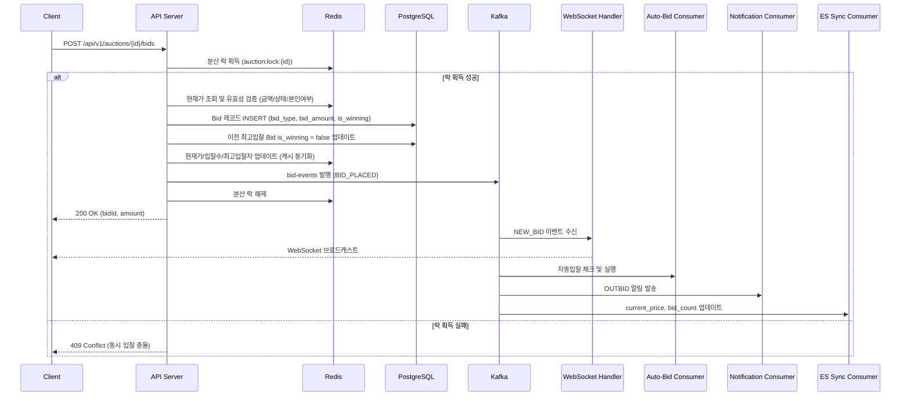
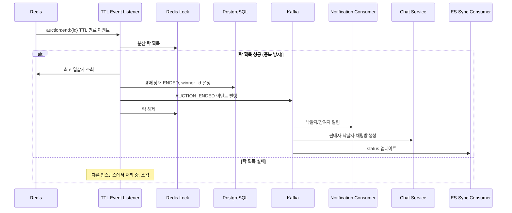
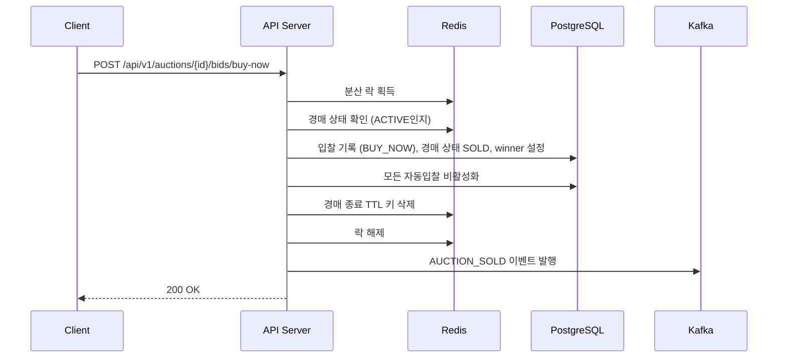
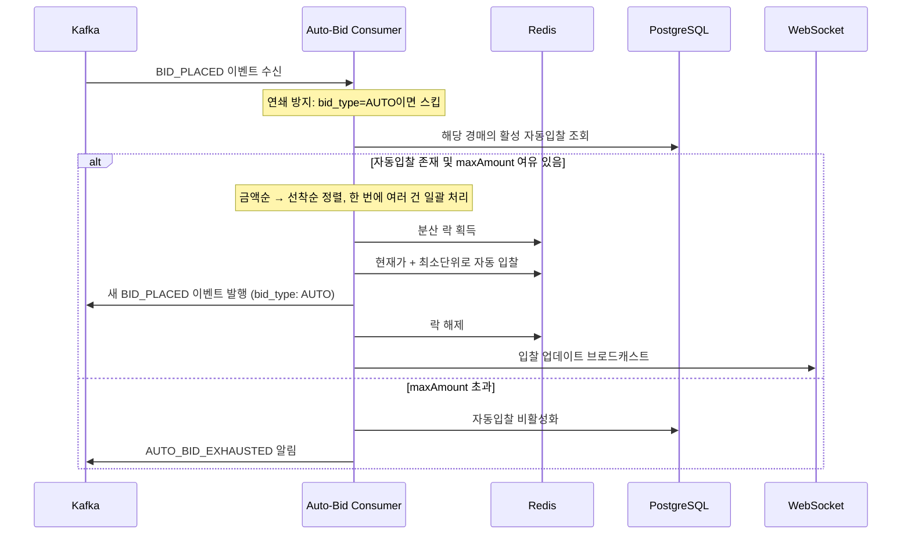

# 시스템 아키텍처 개요

---

# 0. 도메인별 아키텍처 전략

## 결정 사항

복잡도가 높은 **Bid/Auction 도메인에는 포트/어댑터 패턴**을 적용하고, 나머지 도메인은 **레이어드 패턴**을 유지합니다.

## 선택 이유

- **Bid/Auction이 포트/어댑터인 이유**: 이 두 도메인은 Redis 분산 락, Kafka 이벤트, ES 동기화, 자동 입찰 연쇄 처리 등 외부 시스템 의존이 4~5개로 가장 많습니다. 의존성 역전을 적용하면 Service가 순수 Java 인터페이스(포트)에만 의존하므로, 동시 입찰/자동 입찰/스나이핑 방지 같은 복잡한 비즈니스 로직을 프레임워크 독립적으로 테스트할 수 있습니다. 외부 시스템 교체(Redisson→Lettuce 등) 시에도 domain 코드 변경이 불필요합니다.
- **나머지가 레이어드인 이유**: Member, Chat, Review, Notification, Report는 외부 의존이 적고 비즈니스 로직이 단순(CRUD + 알파 수준)합니다. 포트 인터페이스/구현체 분리에 따른 보일러플레이트 대비 이점이 부족하므로 레이어드 구조로 유지합니다.

## 포트 목록

| 포트 인터페이스 (biddo-domain) | 구현체 (biddo-infra) | 역할 |
| --- | --- | --- |
| `AuctionRepository` | `AuctionRepositoryImpl`  • `AuctionJpaRepository` | DB 접근 추상화 |
| `BidRepository` | `BidRepositoryImpl`  • `BidJpaRepository` | DB 접근 추상화 |
| `BidEventPublisher` | `KafkaBidEventPublisher` | Kafka 이벤트 발행 추상화 |
| `AuctionCachePort` | `RedisAuctionCache` | Redis 현재가/입찰수/분산 락 추상화 |
| `AuctionSchedulePort` | `RedisAuctionSchedule` | Redis TTL 기반 경매 종료 스케줄링 추상화 |
| `SearchIndexPort` | `ElasticsearchSearchIndex` | ES 동기화 추상화 |

---

# 1. WebSocket vs SSE 역할 분담

## 결정 사항

| 기술 | 담당 기능 | 통신 방향 |
| --- | --- | --- |
| **WebSocket** | 입찰 실시간 업데이트, 1:1 채팅 | 양방향 |
| **SSE** | 알림 푸시, 카운트다운 동기화 | 서버 → 클라이언트 단방향 |

## 선택 이유

**WebSocket을 입찰/채팅에 사용하는 이유:**

- 입찰은 클라이언트가 서버로 데이터를 보내고(입찰 요청), 서버가 다른 클라이언트에게 브로드캐스트하는 양방향 통신이 필요.
- 채팅은 메시지 송수신이 모두 실시간으로 이루어져야 하므로 양방향 필수.
- 하나의 WebSocket 연결로 입찰+응답을 처리할 수 있어 연결 오버헤드 절감.

**SSE를 알림/카운트다운에 사용하는 이유:**

- 알림은 서버에서 클라이언트로만 보내면 되는 단방향 통신.
- SSE는 HTTP 기반이라 방화벽/프록시 호환성이 WebSocket보다 우수.
- 자동 재연결 내장으로 네트워크 불안정 시에도 안정적.
- 카운트다운은 서버 시간 동기화 푸시만 필요하므로 단방향으로 충분.

## 연결 관리

| 항목 | WebSocket | SSE |
| --- | --- | --- |
| 연결 단위 | 경매 구독 / 채팅방 | 사용자별 1개 |
| 인증 | JWT 토큰으로 초기 연결 시 검증 | JWT 토큰으로 구독 시 검증 |
| 재연결 | 클라이언트 측 구현 필요 | 브라우저 내장 지원 |
| EC2 2대 처리 | Redis Pub/Sub로 인스턴스 간 동기화 | Redis Pub/Sub로 동기화 |

---

# 2. 동시 입찰 처리: Redis 분산 락

## 결정 사항

동시 입찰 처리에 **Redis 분산 락 (Redisson)**을 사용합니다.

## 선택 이유

- **EC2 2대 구성**: DB 낙관적 락은 단일 인스턴스에서는 유효하지만, 다중 인스턴스 환경에서는 동일한 경매에 동시 입찰 요청이 서로 다른 EC2로 라우팅될 수 있음.
- **Redis 분산 락은 여러 애플리케이션 인스턴스 간에 원자성을 보장**: 경매 ID 기반으로 락을 걸어 한 번에 하나의 입찰만 처리.
- **성능**: Redis는 인메모리 DB로 락 획득/해제가 밀리세컨드 단위. DB 락보다 빠름.
- **Redisson 라이브러리**: 락 재시도, 타임아웃, 리더 선출 등을 내장 제공.

## 락 전략

| 항목 | 값 |
| --- | --- |
| Lock Key | `auction:lock:{auctionId}` |
| 대기 시간 | 최대 3초 |
| 락 유지 시간 | 최대 5초 (타임아웃 후 자동 해제) |
| 재시도 | 없음 (3초 내 획득 실패 시 입찰 실패 응답) |

---

# 3. Kafka 파티셔닝 전략

## 결정 사항

**경매 ID(auctionId) 기반 파티셔닝**을 사용합니다.

## 선택 이유

- **동일 경매의 이벤트는 항상 같은 파티션으로**: 하나의 경매에 대한 입찰 이벤트들이 순서대로 처리됨을 보장. 입찰 순서가 꼬이면 경매 결과가 불일치해질 수 있으므로 순서 보장이 중요.
- **자동 입찰 처리 순서 보장**: 동일 경매의 입찰 → 자동입찰 트리거 → 알림이 순서대로 처리.
- **병렬 처리**: 다른 경매의 이벤트는 다른 파티션에서 병렬 처리되어 성능 확보.

## 토픽별 파티션 설정

| 토픽 | 파티션 Key | 파티션 수 | 이유 |
| --- | --- | --- | --- |
| `bid-events` | auctionId | 6 | 입찰 순서 보장 필수, 경매별 격리 |
| `auction-events` | auctionId | 3 | 경매 상태 변경 순서 보장 |
| `notification-events` | receiverId | 3 | 사용자별 알림 분산 |
| `chat-events` | chatRoomId | 3 | 채팅방별 메시지 순서 보장 |

---

# 4. Elasticsearch 동기화: Kafka CDC

## 결정 사항

**Kafka 이벤트 기반 CDC (Change Data Capture)** 방식으로 동기화합니다.

## 선택 이유

- **실시간 반영**: 경매 등록/수정/상태 변경 시 즉시 ES에 반영. 스케줄러 폴링 방식은 지연 발생.
- **이미 Kafka를 사용 중**: 입찰/경매 이벤트가 이미 Kafka로 날아가므로, 별도 Consumer를 추가하면 추가 인프라 없이 동기화 가능.
- **데이터 일관성**: 이벤트 기반이라 DB와 ES 간 데이터 불일치 최소화.
- **장애 복구**: Kafka의 메시지 리플레이로 ES 장애 시 재색인 가능.

## 동기화 플로우

> - 시간 만료 종료: `AUCTION_ENDED` 이벤트 발행 → DB `status: ENDED`
>

> - 즉시구매 종료: `AUCTION_SOLD` 이벤트 발행 → DB `status: SOLD`
>

> 두 이벤트 모두 `auction-events` 토픽으로 발행, ES Sync Consumer가 구분하여 처리.
>

```
[Auction Service] → auction-events 토픽 → [ES Sync Consumer] → [Elasticsearch]
[Bid Service] → bid-events 토픽 → [ES Sync Consumer] → price/bidCount 업데이트
```

| 이벤트 | ES 작업 |
| --- | --- |
| AUCTION_CREATED | 새 도큐먼트 생성 (index, status: PENDING) |
| AUCTION_ACTIVATED | status 필드 PENDING → ACTIVE 업데이트 |
| AUCTION_UPDATED | 도큐먼트 업데이트 (update) |
| AUCTION_ENDED / SOLD | status 필드 업데이트 |
| BID_PLACED | current_price, bid_count 업데이트 (partial update) |

---

# 5. 경매 종료 스케줄링: Redis TTL 이벤트

## 결정 사항

**Redis Keyspace Notification (TTL 만료 이벤트)**를 사용합니다.

## 선택 이유

- **실시간 정확성**: 경매 종료 시간에 정확히 이벤트가 발생. Spring Scheduler는 폴링 주기에 따라 수초~수십초 지연 발생 가능.
- **스나이핑 방지와 연동**: 경매 연장 시 Redis Key의 TTL을 연장하면 자연스럽게 새 종료 시간에 이벤트 발생.
- **EC2 2대 구성에 적합**: Redis 이벤트는 모든 인스턴스에서 수신 가능. 다만 중복 처리 방지를 위해 분산 락으로 1회만 실행.
- **Quartz 불필요**: 별도 DB 테이블이나 클러스터링 없이 Redis만으로 간단하게 구현.

## 동작 플로우

```jsx
0. 경매 등록 시 (PENDING → ACTIVE 전환):
   Redis SET auction:start:{auctionId} "" EX {seconds_until_start}
   TTL 만료 시 → status PENDING → ACTIVE 변경 + AUCTION_ACTIVATED 이벤트 발행
   (start_time = 현재시간이면 즉시 ACTIVE로 생성, TTL 키 불필요)

1. 경매 시작(ACTIVE) 시:
   Redis SET auction:end:{auctionId} "" EX {seconds_until_end}

2. TTL 만료 시:
   Redis Keyspace Notification → __keyevent@0__:expired
   → auction:end:{auctionId} 키 만료 감지

3. 경매 종료 처리:
   분산 락 획득 → 낙찰자 결정 → 상태 변경 → 알림 발송 → 채팅방 생성

4. 스나이핑 방지 연장 시:
   Redis DEL auction:end:{auctionId}
   Redis SET auction:end:{auctionId} "" EX {new_seconds}
```

## 주의사항

- Redis Keyspace Notification 활성화 필요: `CONFIG SET notify-keyspace-events Ex`
- TTL 만료는 "best-effort" 라 정확히 만료 시간에 발생하지 않을 수 있음. 보완책으로 1분 주기 스케줄러로 만료된 경매 체크.
- ElastiCache는 Keyspace Notification을 지원하지만, 설정 확인 필요.

## TTL 보완 스케줄러 상세

- **실행 주기**: 1분마다 `@Scheduled(fixedRate = 60000)`
- **대상 쿼리**: `SELECT * FROM auction WHERE status = 'ACTIVE' AND end_time <= NOW()` (end_time이 이미 지난 ACTIVE 경매)
- **처리**: 분산 락 획득 후 경매 종료 플로우 실행 (TTL 이벤트와 동일)
- **애플리케이션 재시작 대응**: 시작 시 모든 ACTIVE 경매의 Redis TTL 키를 재등록하는 초기화 로직 포함

---

# 6. Elasticsearch 장애 대응: DB Fallback 검색

## 결정 사항

ES 장애 시 **서킷 브레이커 패턴**으로 DB 기반 fallback 검색으로 자동 전환합니다.

## 전략

- **Resilience4j CircuitBreaker** 적용: ES 요청 실패률 50% 이상 (10초 기준) 시 회로 오픈
- **Fallback**: PostgreSQL `LIKE` + `idx_auction_status_end_time` 인덱스 활용한 기본 검색
- **제한**: Fallback 모드에서는 키워드 검색만 지원 (카테고리 필터, 가격 범위). 연관 검색, 점수 기반 정렬은 미지원
- **복구**: Half-Open 상태에서 5회 성공 시 회로 클로즈 → ES 복귀
- **모니터링**: fallback 발동 시 Prometheus 메트릭 + Slack 알림

---

# 7. SSE 재연결 시 미수신 알림 복구

## 결정 사항

**Last-Event-ID** 기반 재전송으로 연결 끊김 중 유실된 알림을 복구합니다.

## 동작 플로우

1. SSE 이벤트 발송 시 각 이벤트에 `id` 필드로 `notification_id` 포함
2. 클라이언트 재연결 시 브라우저가 자동으로 `Last-Event-ID` 헤더 전송
3. 서버는 `Last-Event-ID` 이후의 미읽음 알림을 DB에서 조회하여 재전송
4. 재전송 후 실시간 스트림 정상 재개

## 구현 세부

- SSE 이벤트 형식: `id: {notificationId}\nevent: {type}\ndata: {json}\n\n`
- 재전송 쿼리: `SELECT * FROM notification WHERE receiver_id = ? AND notification_id > ? AND is_read = false ORDER BY created_at`
- 최대 재전송: 100건 (너무 오래 끊긴 경우 잠림)

---

# 8. 이미지 처리: 썸네일 생성 & CDN 최적화

## 결정 사항

업로드 시 **Lambda@Edge 리사이징**으로 썸네일을 자동 생성합니다.

## 처리 플로우

1. 클라이언트가 S3에 원본 이미지 업로드 (Presigned URL)
2. CloudFront로 이미지 요청 시 URL 파라미터로 크기 지정: `?w=200&h=200&fit=cover`
3. Lambda@Edge (Origin Response)가 요청된 크기로 리사이징 후 응답
4. CloudFront가 리사이징된 결과를 캐싱

## 크기 프리셋

| 용도 | 크기 | 설명 |
| --- | --- | --- |
| 썸네일 | 200x200 | 목록 페이지 카드 |
| 중간 | 400x400 | 상세 페이지 미리보기 |
| 원본 | - | 상세 페이지 전체 보기 |

---

# 9. 시퀀스 다이어그램

## 9-1. 입찰 처리 플로우



## 9-2. 경매 종료 플로우



## 9-3. 즉시 구매 플로우



## 9-4. 자동 입찰 플로우



### 자동 입찰 연쇄 방지 전략

- **Auto-Bid Consumer는 `bid_type: AUTO`인 이벤트를 무시**: 자동 입찰이 발행한 BID_PLACED는 다시 자동 입찰을 트리거하지 않음
- **일괄 처리**: 수동 입찰(MANUAL/BUY_NOW) 이벤트 수신 시, 해당 경매의 모든 활성 자동입찰을 한 번에 정리 (최종 낙찰자 1명만 결정)
- **최대 연쇄 횟수 제한**: 만약 예외 상황으로 AUTO 이벤트가 연쇄되더라도, 경매당 최대 10회 연쇄 후 중단 및 로그 경고